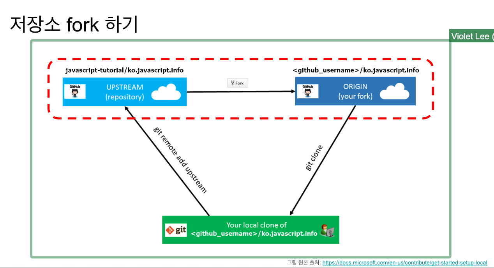

# GitHub 레포지토리 연결

`git remote add origin "주소"`

`git branch -m main`

`git push -u origin main`

**깃 : `분산` 버전 관리 도구**

### 저장소 fork 하기

fork - 다른 저장소에서 내 저장소로 옮겨오기, 깃이력 없음, 로컬에도 없음
degit - 다른 저장소에서 내 로컬로 옮겨오기, 깃이력 없음, 온라인 저장소엔 없음
clone - 다른 저장소에서 내 로컬로 옮겨오기, 깃 이력 있음, 온라인 저장소엔 없음

fork : github 에서만 쓰는 용어

github
gitlab
bitbucket
codecommit

id, pw 방식은 보안상 위험이 많은 인증방식
2021.8월 중순 GitHub 은 기본 인증방식이 id, pw 방식이 아닌 `토큰` 방식으로 사용하겠다 선언

**upstream 저장소의 main 브랜치에 있는 모든 커밋들을 가지고 오는 기능**

`git pull upstream main`
