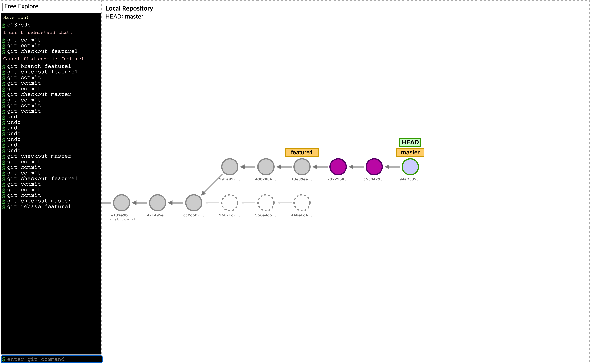

# Rebase

**_re base_**
~에 근거지(본부)를 두다

### 실습 내용

### Git 이 사용되는 예시

git 을 만든사람 : linux torvals(리눅스 커널 만든사람)

리눅스라고 하는 거대한 오픈소스를 유지보수 하는데, 불편한 점이 많았다.

리눅스라고 하는 오픈소스는 전세계에서 수천명이 기여하고 있는데 이에 git 이 사용된다 !

### 브랜치를 병합하는 두 가지 방법

- 머지와 리베이스
- 머지

  - 일반적으로 머지 커밋이 생긴다(3-way merge시).
    - 머지커밋의 부모커밋이 2개가 되어서 커밋 그래프가 복잡해진다.
  - 머지한 시점을 정확히 파악할 수 있다.

- 리베이스
  - 머지 커밋이 생기지 않는다
    - 커밋 그래프가 단순해진다.
  - 리베이스 후에는 커밋 id가 바뀐다.
    - 혼자 작업하는 브랜치에서만 리베이스를 쓰는 것을 권장

### 작업을 할 때 지켜야할 서로 간의 약속

[우아한 형제의 기술 블로그](https://techblog.woowahan.com/2553/)

저희는 작업을 할 때 지켜야 할 몇 가지 약속이 있습니다.

1. 작업을 시작하기 전에 JIRA 티켓을 생성합니다.
2. 하나의 티켓은 되도록 하나의 커밋으로 합니다.
3. 커밋 그래프는 최대한 단순하게 가져갑니다.
4. 서로 공유하는 브랜치의 커밋 그래프는 함부로 변경하지 않습니다.
5. 리뷰어에게 꼭 리뷰를 받습니다.
6. 자신의 Pull Request는 스스로 merge 합니다.
